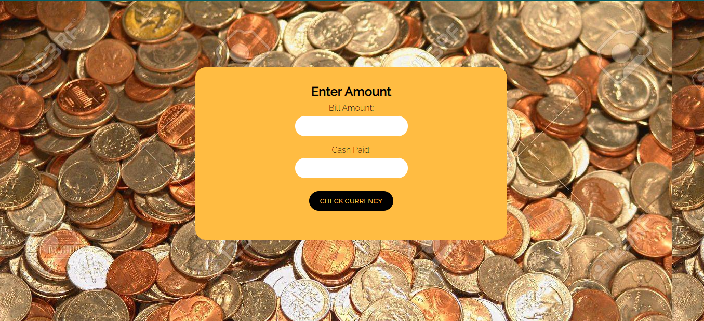

# CASH REGISTER

This app will accept two inputs one for the bill amount and other one is for cash paid. It will return the cash amount in form of diffrent currencies in order of high value to low value.

> This project is part of neog.camp. It is mark 10 <b>CASH REGISTER</b>.
> 
